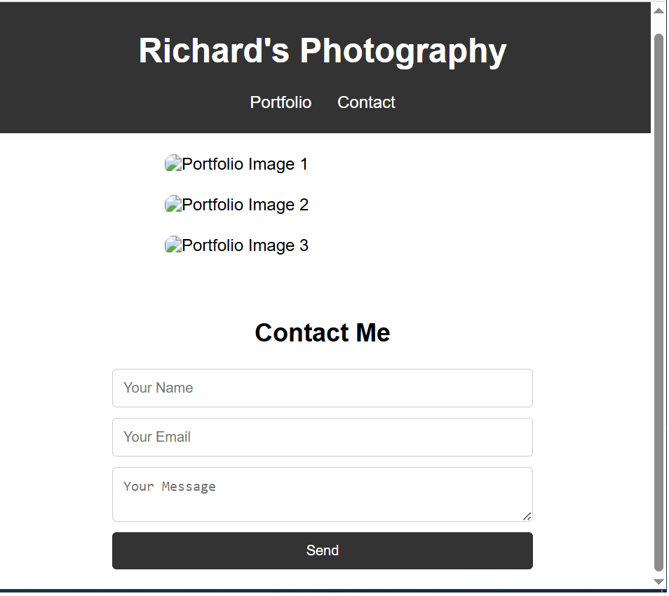

# 📸 Responsive Landing Page for Photographer

A modern, responsive landing page built with **HTML**, **TailwindCSS**, and minimal JavaScript. Designed for photographers or creative professionals who want to showcase their portfolio online.

---

## 🌐 Live Demo

👉 [View the live site here](https://richard-vs.github.io/landing-page-demo/)

---

## 📦 Features

✅ Clean and minimalistic design  
✅ Fully responsive (desktop, tablet, mobile)  
✅ Navigation bar with smooth scrolling  
✅ Portfolio grid with placeholder images  
✅ Contact form (name, email, message)

---

## 🛠️ Technologies Used

- HTML5
- TailwindCSS (via CDN)
- JavaScript (for basic interactions)

---

## 📂 File Structure

landing-page-demo/
├── index.html
├── style.css
└── README.md

---

## 📷 Screenshots

### 💻 Desktop View

---

## ✨ Author

👤 **Richard von Schütz**
